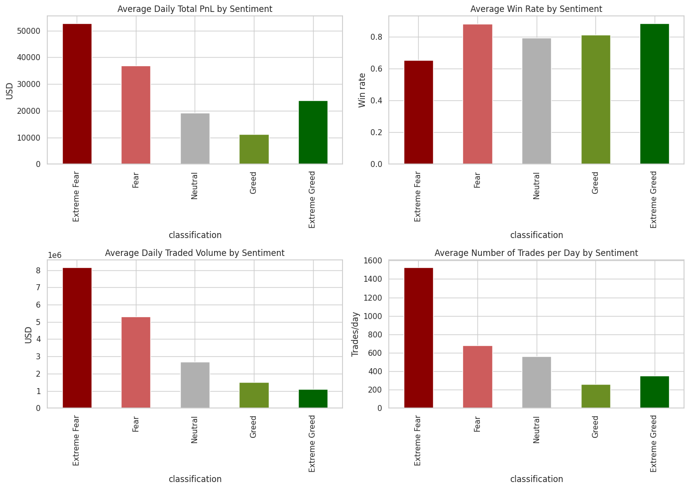
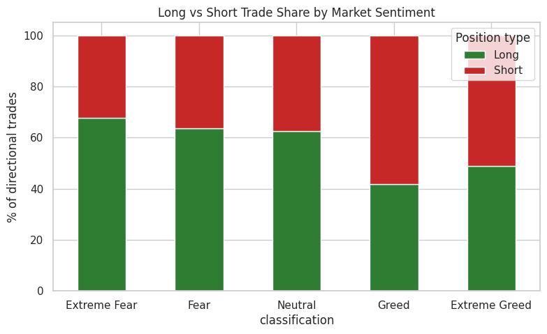
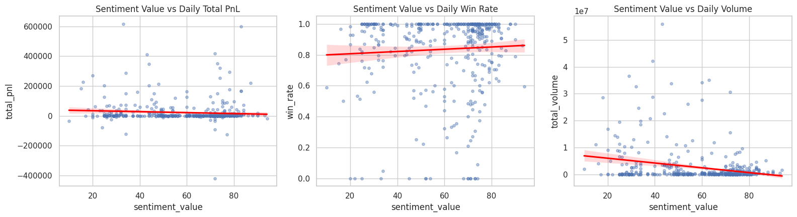
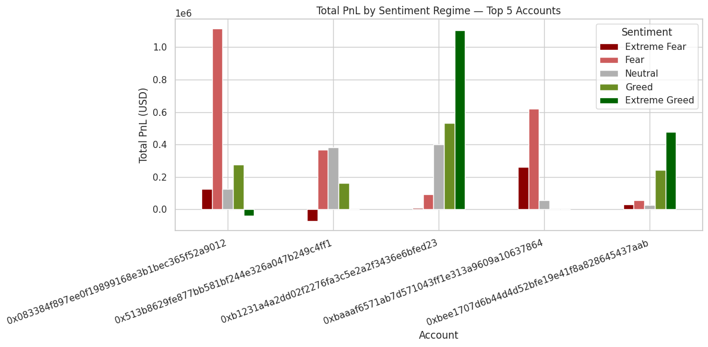

# 📊 Trader Behavior vs Market Sentiment

**Exploring how Bitcoin's Fear & Greed Index relates to trader performance, positioning, and activity.**


---

## 🎯 Objective

Do traders perform differently when the market is fearful versus greedy? This project merges trade-level execution data with the daily Bitcoin Fear & Greed Index to answer:

- Does profitability shift with market sentiment?
- Do traders go long or short more depending on sentiment?
- Does trading activity (volume, frequency) change with sentiment?
- Are the *best* traders sentiment-sensitive too?

## 🗂️ Datasets

| File | Description |
|---|---|
| `historical_data.csv` | ~211K trade executions across 32 accounts and 246 coins — price, size, side, direction, PnL, fees, timestamps |
| `fear_greed_index.csv` | Daily Bitcoin market sentiment score (0–100) and classification (Extreme Fear → Extreme Greed), 2018–2025 |

## 🔍 Methodology

1. Parsed trade timestamps and joined each trade with that day's sentiment reading
2. Aggregated trades to a **daily level** (total PnL, volume, trade count, win rate) so sentiment regimes with different day-counts could be compared fairly
3. Simplified `Direction` into `Long` / `Short` / `Other` to study positioning bias
4. Compared performance, activity, and positioning across the 5 sentiment classes
5. Ran correlation analysis between the raw sentiment score and daily performance metrics
6. Zoomed into the top 5 accounts by total PnL to check if the pattern holds for the best traders

## 📈 Key Findings

### 1. PnL and activity peak during Extreme Fear


Average daily PnL, volume, and trade count are all **highest during Extreme Fear** and decline steadily toward Greed — this cohort trades more, and more profitably, when the market is scared.

### 2. Traders lean long in fear, short in greed


~68% of directional trades during Extreme Fear are **Long**; that share flips toward **Short** as sentiment moves into Greed — a classic contrarian, "buy the dip" pattern.

### 3. Sentiment score correlates negatively with PnL and volume


As the sentiment score rises (greedier), daily PnL and volume trend down. Win rate, however, barely moves — the edge comes from **when and how much** they trade, not from picking better trades.

### 4. The pattern holds for top performers


The 5 most profitable accounts generate a disproportionate share of their PnL during Fear/Extreme Fear periods.

## 🧠 Takeaways

| Insight | Implication |
|---|---|
| Contrarian edge | Profit is concentrated in fear regimes, not greed |
| Activity follows fear | More trades and volume happen when sentiment is low |
| Directional bias tracks sentiment | Long-heavy in fear, more short exposure in greed |
| Win rate is sentiment-agnostic | Edge is in sizing/timing, not accuracy |

**Caveat:** Sample is ~32 accounts with only 14 Extreme Fear days — enough to see a clear pattern, not enough to call it universal.

## 🛠️ Tech Stack

`Python` · `Pandas` · `NumPy` · `Matplotlib` · `Seaborn` · `Jupyter Notebook`

## 🚀 How to Run

```bash
git clone https://github.com/<your-username>/trader-behavior-sentiment-analysis.git
cd trader-behavior-sentiment-analysis
pip install pandas numpy matplotlib seaborn jupyter
jupyter notebook trader_sentiment_analysis.ipynb
```

## 📁 Repo Structure

```
├── trader_sentiment_analysis.ipynb   # Full analysis notebook (executed, with charts)
├── historical_data.csv               # Raw trade-level data
├── fear_greed_index.csv              # Daily sentiment index
├── images/                           # Chart exports used in this README
└── README.md
```

## 👤 Author

**Pranav Mahadev Raikar**
📧 pranavraikar70@gmail.com
